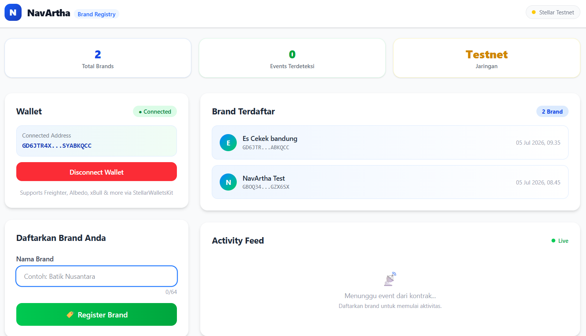
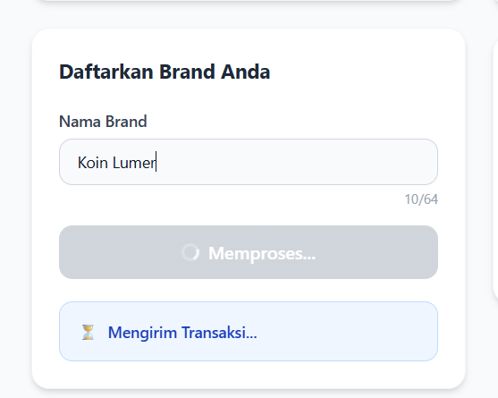
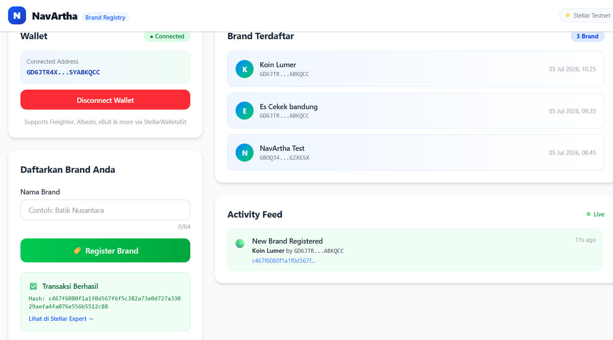
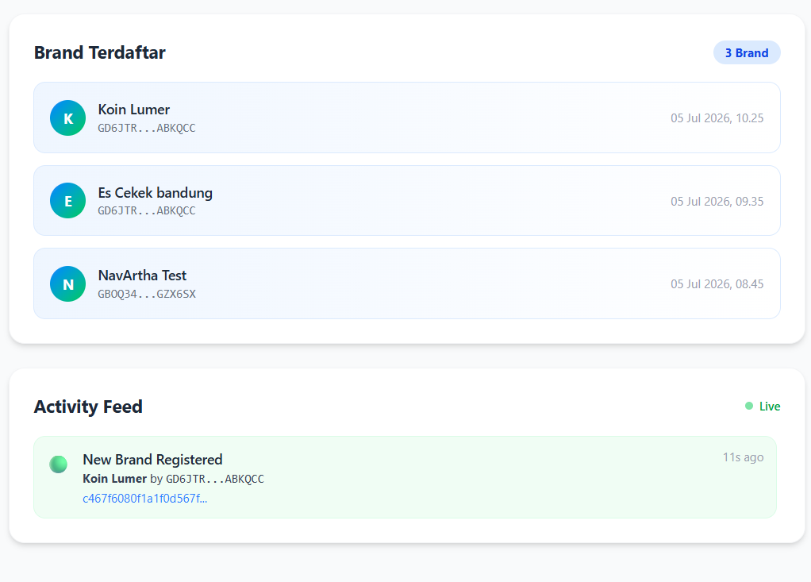

# NavArtha Brand Registry — Stellar Level 2 dApp

[](https://stellar.org)
[](https://soroban.stellar.org)
[](https://nextjs.org)

---

## Project Description

**NavArtha Brand Registry** adalah MVP blockchain Level 2 dari platform NavArtha — platform Web3 untuk membantu UMKM Indonesia berkembang melalui transparansi dan tata kelola berbasis blockchain.

Aplikasi ini membuktikan integrasi penuh Soroban Smart Contract dengan frontend Next.js:
- Mendaftarkan brand UMKM secara permanen di blockchain Stellar
- Membaca semua data brand langsung dari kontrak
- Menampilkan event real-time saat brand baru terdaftar
- Multi-wallet support via StellarWalletsKit

---

## Architecture

```
navartha-dapp-2/
├── contract/               # Soroban Smart Contract (Rust)
│   ├── src/lib.rs          # BrandRegistry contract logic
│   └── Cargo.toml
└── frontend/               # Next.js App
    ├── app/
    │   ├── page.tsx        # Main dashboard page
    │   ├── layout.tsx
    │   └── globals.css
    ├── components/
    │   ├── WalletSection.tsx       # Multi-wallet connect/disconnect
    │   ├── RegisterBrandForm.tsx   # Form + tx lifecycle + status card
    │   ├── BrandList.tsx           # Reads all brands from contract
    │   └── ActivityFeed.tsx        # Real-time event feed
    ├── context/
    │   └── WalletContext.tsx       # StellarWalletsKit state provider
    ├── lib/
    │   └── stellar.ts              # Contract interaction utilities
    └── types/
        └── index.ts                # Shared TypeScript types
```

---

## Tech Stack

| Layer | Technology |
|-------|------------|
| Frontend | Next.js 16 (App Router), TypeScript, Tailwind CSS |
| Wallet | StellarWalletsKit (`@creit.tech/stellar-wallets-kit`) |
| Blockchain | Stellar Testnet, Soroban RPC |
| SDK | `@stellar/stellar-sdk` |
| Smart Contract | Soroban (Rust) |

---

## Installation

### Prerequisites
- Node.js 18+
- Rust + `wasm32-unknown-unknown` target
- Stellar CLI (`stellar`)
- Freighter Wallet (browser extension)

### Install Rust WASM target
```bash
rustup target add wasm32-unknown-unknown
```

---

## How to Run Frontend

```bash
# 1. Go to frontend directory
cd ~/stellar-projects/navartha-dapp-2/frontend

# 2. Install dependencies (inside WSL/Linux)
npm install

# 3. Copy env file and fill in your contract ID after deployment
cp .env.local .env.local   # Already created

# 4. Run development server
npm run dev
```

Open `http://localhost:3000` in your browser.

---

## How to Build the Contract

```bash
cd ~/stellar-projects/navartha-dapp-2/contract

# Build WASM binary
cargo build --target wasm32-unknown-unknown --release

# Output will be at:
# target/wasm32-unknown-unknown/release/navartha_brand_registry.wasm
```

---

## How to Deploy the Contract

```bash
# 1. Setup Stellar CLI with a funded testnet keypair
stellar keys generate navartha-admin --network testnet
stellar keys fund navartha-admin --network testnet

# 2. Deploy contract
stellar contract deploy \
  --wasm target/wasm32-unknown-unknown/release/navartha_brand_registry.wasm \
  --source navartha-admin \
  --network testnet

# 3. Copy the Contract ID returned, then update .env.local:
# NEXT_PUBLIC_CONTRACT_ID=<your_contract_id>
```

---

## How to Invoke the Contract

```bash
# Register a brand (example)
stellar contract invoke \
  --id <YOUR_CONTRACT_ID> \
  --source navartha-admin \
  --network testnet \
  -- register_brand \
  --owner <YOUR_PUBLIC_KEY> \
  --name "Batik Nusantara"

# Get all brands
stellar contract invoke \
  --id <YOUR_CONTRACT_ID> \
  --source navartha-admin \
  --network testnet \
  -- get_all_brands
```

---

## Wallet Setup

1. Install [Freighter](https://www.freighter.app/) browser extension
2. Create or import a wallet
3. Go to Settings → Network → Switch to **Testnet**

---

## Testnet Faucet

Get free testnet XLM:
```
https://friendbot.stellar.org/?addr=YOUR_PUBLIC_KEY
```
Or use [Stellar Laboratory](https://laboratory.stellar.org/#create-account?network=testnet).

---

## Environment Variables

| Variable | Description |
|----------|-------------|
| `NEXT_PUBLIC_CONTRACT_ID` | Your deployed contract address |
| `NEXT_PUBLIC_NETWORK_PASSPHRASE` | `Test SDF Network ; September 2015` |
| `NEXT_PUBLIC_RPC_URL` | `https://soroban-testnet.stellar.org` |
| `NEXT_PUBLIC_HORIZON_URL` | `https://horizon-testnet.stellar.org` |

---

## Admin Access (Frontend)

This dApp implements a frontend-only admin access control based on Stellar public keys. The admin check is performed entirely in the browser using the connected wallet's public key and a whitelist configured via environment variable.

- Configure admin wallets via `.env.local`:

```env
NEXT_PUBLIC_ADMIN_WALLETS=GADMINPUBLICKEY1,GADMINPUBLICKEY2
```

- Behavior:
  - When a user connects a wallet, the frontend reads the wallet's public key.
  - The helper `isAdminWallet` checks if the public key exists in `NEXT_PUBLIC_ADMIN_WALLETS` (or a fallback default list in code).
  - If the connected wallet is an admin, the `Admin Approvals` menu appears in the sidebar and the user can access `/admin`.
  - If not an admin, the admin menu is hidden and direct access to `/admin` will show an unauthorized message or redirect to `/`.

Notes:
  - This is a UI-level check (convenient and simple). For stronger security, protect admin actions on-chain or via a server-side ACL.
  - The relevant frontend files are `frontend/lib/adminWallets.ts`, `frontend/context/WalletContext.tsx`, `frontend/components/AdminGuard.tsx`, and `frontend/components/Sidebar.tsx`.


---

## 📸 Screenshots

### 1. 🔗 Wallet Connected & Brand Registration

Users connect their Stellar wallet using **StellarWalletsKit**, which supports Freighter, Albedo, xBull, and other popular Stellar wallets. Once connected, the brand registration form becomes available. The form includes input validation and prepares a Soroban smart contract transaction for submission.



---

### 2. ⏳ Transaction Pending

After submitting the registration form, the application enters a loading state while the transaction is signed by the connected wallet and submitted to the Stellar Testnet. During this phase, the submit button is disabled and a loading indicator is displayed to reflect the pending transaction status.



---

### 3. ✅ Transaction Success

Once the transaction is confirmed on-chain, the UI displays a success message along with the transaction hash. A direct link to **Stellar Expert** is provided so users can independently verify the transaction on the blockchain.



---

### 4. 📋 Registered Brands & Activity Feed

The frontend fetches all registered brands directly from the deployed Soroban smart contract via Stellar RPC. Every successful brand registration emits a `BrandRegistered` event, which is captured and displayed in the real-time activity feed.



---

## Contract Address

```
Contract ID: CC7XUZJ2FFMA64XKX2W5LG5YKUG7GPMQZFDM3NXLWTULQD26NGPZ2ON6
Explorer: https://stellar.expert/explorer/testnet/contract/CC7XUZJ2FFMA64XKX2W5LG5YKUG7GPMQZFDM3NXLWTULQD26NGPZ2ON6
```

## Sample Transaction Hash

```
TX Hash: 500b9c8b3a30872241df4b36743396d8c5fd15bf2b6296804223ce3e762f1d81
Explorer: https://stellar.expert/explorer/testnet/tx/500b9c8b3a30872241df4b36743396d8c5fd15bf2b6296804223ce3e762f1d81
```
